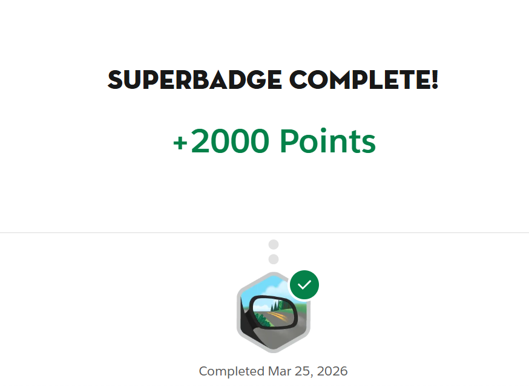

# Superbadge Object Relationships


Implementacao em Salesforce DX para concluir o superbadge de relacionamentos de objetos, com foco no app `World Tour Manager`, nos objetos customizados do desafio e nas configuracoes minimas necessarias para passar na validacao.

## Objetivo

Este repositorio reune a metadata essencial usada para concluir o desafio:

- modelagem entre `Campaign`, `Song__c`, `Album__c`, `Artist__c`, `Performs_On__c` e `Track_List__c`
- app `World Tour Manager`
- layouts e value sets exigidos pelo validador do Trailhead
- permissao complementar para garantir visibilidade do relacionamento em `Song__c`

## Estrutura

```text
.
|-- force-app/
|   `-- main/default/
|       |-- applications/
|       |-- layouts/
|       |-- objects/
|       |-- permissionsets/
|       |-- profiles/
|       |-- standardValueSets/
|       `-- tabs/
|-- manifest/
|-- .github/workflows/
|-- LICENSE
|-- README.md
`-- sfdx-project.json
```

## Principais componentes

- `Artist__c`: artistas e equipe de turne
- `Album__c`: albuns
- `Song__c`: musicas com relacionamento para album
- `Performs_On__c`: junction object entre `Artist__c` e `Song__c`
- `Track_List__c`: junction object entre `Campaign` e `Song__c`
- `World_Tour_Manager`: app Lightning do desafio

## Relacionamentos que fizeram a validacao passar

- `Song__c.Album__c`: `Lookup` para `Album__c`
- `Performs_On__c.Artist__c`: `MasterDetail` para `Artist__c`
- `Performs_On__c.Song__c`: `MasterDetail` para `Song__c`
- `Track_List__c.Campaign__c`: `MasterDetail` para `Campaign` com label `Tour`
- `Track_List__c.Song__c`: `MasterDetail` para `Song__c`

## Como usar

### 1. Pre-requisitos

- Salesforce CLI (`sf`)
- uma org do Trailhead especifica para o superbadge

### 2. Autenticar na org

```shell
sf org login web --alias trailhead-org
```

### 3. Fazer o deploy da metadata essencial

```shell
sf project deploy start --source-dir force-app --target-org trailhead-org
```

### 4. Atribuir o permission set complementar

```shell
sf org assign permset --name Trailhead_Song_Access --target-org trailhead-org
```

### 5. Validar pontos criticos antes do `Check Challenge`

- `Campaign Type` ativo com os valores esperados no desafio
- `Campaign` layout com `Type`, `Show ID` e `Merch Quantity`
- `Track List` com `Campaign__c` e `Song__c` como `MasterDetail`
- `Song` com o relacionamento `Album__c` visivel no layout
- related lists de `Track Lists` aparecendo onde esperado

## Passo a passo resumido para passar no superbadge

1. Criar ou conectar a org correta do Trailhead.
2. Fazer deploy da metadata do projeto.
3. Conferir o app `World Tour Manager`.
4. Validar o objeto `Artist__c` com os campos `Status__c`, `Type__c` e `Guest__c`.
5. Validar `Campaign` com `Show_ID__c`, `Merch_Quantity__c` e `Type`.
6. Garantir os valores certos em `CampaignType`.
7. Garantir que `Track_List__c` seja o junction object entre `Campaign` e `Song__c`.
8. Garantir que `Song__c` tenha o relacionamento `Album__c`.
9. Atribuir o permission set `Trailhead_Song_Access`.
10. Rodar novamente o `Check Challenge` no Trailhead.

## Conquista

Superbadge finalizado com sucesso no Trailhead.

Adicione as imagens finais em `docs/images/` com estes nomes para exibicao automatica no README:

- `docs/images/superbadge-object-relationships-complete.png`
- `docs/images/superbadge-badge.png`
- `docs/images/salesforce-logo.png`

### Resultado final



### Badge


### Salesforce


## CI/CD

O workflow em `.github/workflows/ci.yml` valida a estrutura do repositorio em cada `push` e `pull_request`:

- confirma a presenca dos arquivos essenciais
- valida XMLs principais
- garante que o projeto DX esteja consistente para versionamento

## Observacoes

- este repositorio foi reduzido para focar na metadata essencial do desafio
- os artefatos temporarios de troubleshooting foram ignorados via `.gitignore`
- a badge de CI passa sem depender de segredos ou acesso a org Salesforce

## Autor

Leandro da Silva Stampini
